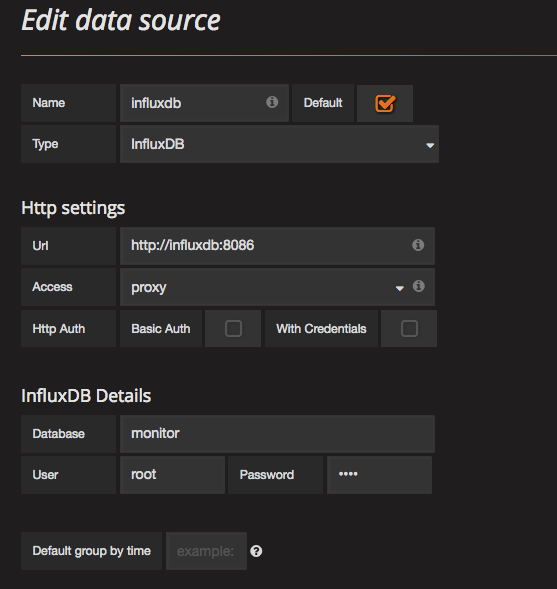

# docker 监控方案实战

influxdb:1.0.0-beta2-alpine

## 部署时序数据库influxdb

生成配置influxdb配置文件(可选)

```shell
docker run --rm influxdb:0.13-alpine influxd config > influxdb.conf
```

启动influxdb

```shell
docker run -d --name influxdb -p 8083:8083 -p 8086:8086 \
      -v $PWD/influxdb:/var/lib/influxdb \
      -e TZ=Asia/Shanghai \
      influxdb:0.13 -config \
      /etc/influxdb/influxdb.conf
```

tips：

+ 如果需要自定义配置则加上"-v $PWD/influxdb.conf:/etc/influxdb/influxdb.conf:ro"
+ 上述命令行中的-e TZ=Asia/Shanghai是设定时区，仅在base image为debain/ubuntu/centos时有效，alpine不支持

访问http://localhost:8083使用query templates创建数据库monitor

```sql
CREATE DATABASE "monitor"
```

测试写数据：

```shell
curl -X "POST" "http://localhost:8086/write?db=monitor" \
	-H "Content-Type: text/plain; charset=utf-8" \
	-d "test,usage=99 host=\"venus\""
```

## 部署cAdvisor

```shell
docker run -d --name=cadvisor \
		-v /:/rootfs:ro \
        -v /var/run:/var/run:rw \
		-v /sys:/sys:ro \
		-v /var/lib/docker:/var/lib/docker:ro \
		-p 8080:8080  \
		--link influxdb:influxdb \
		google/cadvisor:v0.23.2 \
		-logtostderr -v 2 \
		-storage_driver=influxdb \
		-storage_driver_db=monitor \
		-storage_driver_host=influxdb:8086
```

ps: 上述命令中的storage_driver_db的值为上一步创建的数据库的名字

## 部署grafana

```shell
docker run -d --name grafana \
		-p 3000:3000 -e INFLUXDB_HOST=localhost \
		-e GF_SECURITY_ADMIN_PASSWORD=secret  \
		--link influxdb:influxdb \
		grafana/grafana:3.0.4
```

ps: 上述命令中的storage_driver_db的值为第一步创建的数据库的名字

打开浏览器，访问http://localhost:3000，以admin/secret登录，配置influxdb数据源：

 	

再使用Dashboards—>Import功能将面板配置container_stats.json导入。